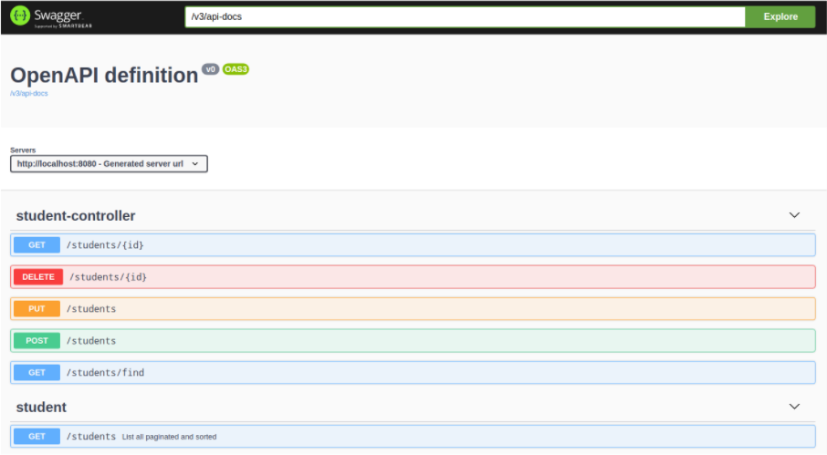
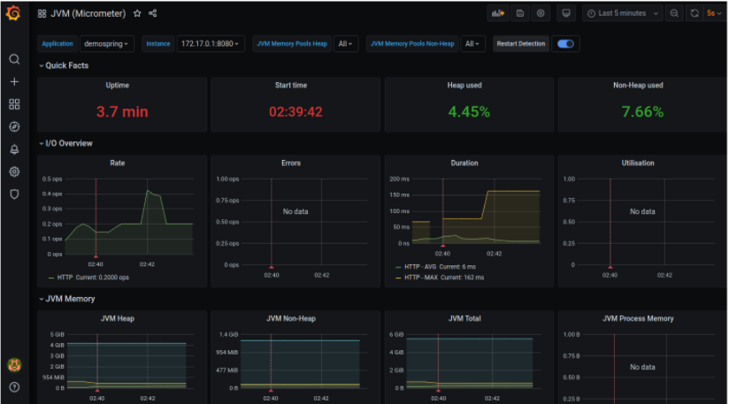

# Spring Boot essentials

Remembering and learning new concepts and techniques in Spring through the playlist: DevDojo Spring Essentials.

https://www.youtube.com/watch?v=4Zjm-rD9FNc&list=PL0Un1HNdB4jHTXBeJ8u3Kaz0NMxuMkmOY

---

## Requirements

1. Java 11
2. Docker or MySQL running natively

## Running

1. Clone this repo
2. Git checkout
3. In the terminal run `docker-compose up` if you don’t have a database running on 3306. If you do, configure the application.yml file to connect to the running database
4. Start the application by running in the terminal `mvn spring-boot:run`
5. Execute the script `init.sql` inside `resources` to generate some users
6. The password for both users is `demospring`
7. Application - http://localhost:8080/swagger-ui/index.html
8. Prometheus - http://localhost:9090/targets
9. Grafana - http://localhost:3000

---

## 1. Swagger UI

 

## 2. Grafana

 

---

## <a name="index">Index</a>

- [01: Behind the scenes]
- [02: @Component, @Autowired and @SpringBootApplication]
- [03: Hot swap] 
- [04: Setup with Spring Initializr]
- [05: Pattern GET pt 01]
- [06: Pattern GET pt 02]   
- [07: Pattern POST]   
- [08: Pattern DELETE]   
- [09: Pattern PUT]   
- [10: Spring Data JPA with MySQL pt 01]   
- [11: Spring Data JPA with MySQL pt 02]   
- [12: Request Params]   
- [13: Exception Handling pt 01]   
- [14: Exception Handling pt 02 - Exception Handler]
- [15: Exception Handling pt 03 - @Transactional]   
- [16: Exception Handling pt 04 - Field Validation]
- [17: Exception Handling pt 05 - Field Validation Handler]   
- [18: Exception Handling pt 06 - Overriding handleExceptionInternal]
- [19: Paging and Sorting pt 01]   
- [20: Paging and Sorting pt 02 - WebMvcConfigurer]
- [21: Paging and Sorting pt 03 - Sorting]   
- [22: RestTemplate pt 01]   
- [23: RestTemplate pt 02 - Exchange]   
- [24: RestTemplate pt 03 - RestTemplate Pageable]   
- [25: RestTemplate pt 04 - RestTemplate POST]  
- [26: RestTemplate pt 05 - RestTemplate PUT and DELETE]
- [27: Tests pt 01 - Spring Data JPA Test]   
- [28: Tests pt 02 - Unit Test Controller]
- [29: Tests pt 03 - Unit Test Service]
- [30: Tests pt 04 - Integration Tests with TestRestTemplate]   
- [31: Tests pt 05 - Maven Profile for Integration Tests]
- [32: Spring Security pt 01 - In Memory Authentication]
- [33: Spring Security pt 02 - CSRF and @PreAuthorize]
- [34: Spring Security pt 03 - @AuthenticationPrincipal Default login]
- [35: Spring Security pt 04 - Auth and Authorization with Spring Data]
- [36: Spring Security pt 05 - Antmatchers]
- [37: Spring Security pt 06 - Adding Basic Authorization Integration]
- [38: Docimentation with SpringDoc OpenAPI]
- [39: Spring Actuator]
- [40: Spring Actuator with Prometheus]
- [41: Spring Micrometer Prometheus and Grafana]

